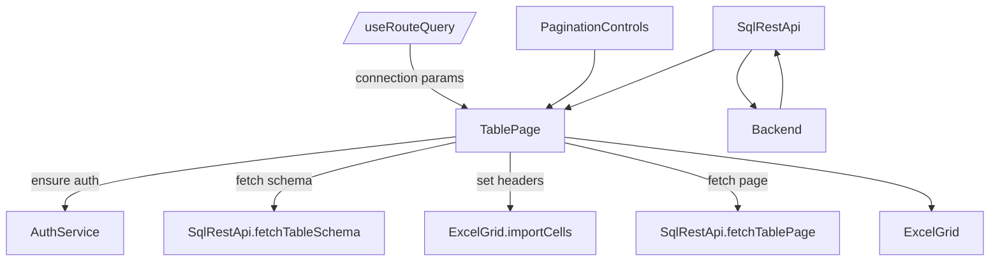

Fast table component.

Use the excel grid component as a typical table component with grid cells for rendering.

Add a separate page to the application for displaying this table component (which is a reusable grid-based table based on the excel grid component).

One of the parameters of this table is the connection string to the database and the table or view name to query.

The field names should be derived from the database schema.
The data should be loaded asynchronously and displayed in the grid cells.
The table should support pagination for large datasets.
The table should also support sorting and filtering on the column headers.

## Fast Table Component Plan

Build a reusable, database-backed table experience on top of the existing `ExcelGrid` foundation. This document captures the functional requirements, UX, data flow, and implementation steps needed to ship it.

### High-level goals
1. Provide a dedicated **Table Page** inside the Vite app that showcases the grid acting as a typical read-heavy data table.
2. Allow the page/component to be reused elsewhere by configuring **connection details** (connection string + table or view name).
3. Keep the experience _fast_: virtualized rendering (already handled by ExcelGrid), asynchronous data loading, client-side sort/filter, and paginated fetches for large datasets.

### Page structure
- Introduce React Router (or a light-weight custom router) and add `/table` route.
- Layout: sticky header with table title + connection info, toolbar for pagination + filter reset, main content with ExcelGrid instance, footer status bar (record counts, errors).
- Page props / query string:
  - `connectionString`: encrypted/encoded string for backend to use when talking to SQL REST API.
  - `schema`: optional when table name already schema-qualified.
  - `table`: required table or view.
  - `pageSize`: optional, default 100.

### Data access
- Extend backend (`sqlrest`) with an endpoint that accepts a **connection string override** (server-side secure usage). To avoid exposing secrets, require JWT auth + encrypt connection string client-side or store per-user on backend. (MVP: allow selecting from predefined connection profiles.)
- Frontend service additions in `sqlRestApi.ts`:
  - `fetchTableSchema(schema, table, connectionId?)` to return column metadata + primary key info.
  - `fetchTablePage({ schema, table, page, pageSize, sort, filters, connectionId? })` returning `PaginatedResponse<Record<string, any>>`.
  - `fetchConnectionProfiles()` to populate dropdown.
- All requests must include auth token and, when provided, a `X-Connection-Id` header referencing backend-stored connection info. (Never send raw connection strings from browser unless encrypted.)

### Grid integration tasks
1. **Initialize table metadata**
   - After loading schema, map column order to ExcelGrid columns.
   - Create header row cells using column names; mark range as table metadata so sort/filter UI hooks apply.

2. **Paging**
   - Maintain `currentPage`, `pageSize`, `totalPages` in page state.
   - Provide MUI `Pagination` component below grid plus keyboard shortcuts (PgUp/PgDn).
   - Reuse ExcelGrid `importCells` to push each page of data starting at row 1 beneath headers. Clear previous page rows before inserting to avoid ghost rows.

3. **Sorting**
   - When user clicks header cell (existing ExcelGrid behavior), intercept sort intent.
   - Instead of client-only sorting, call backend with `sortColumn` + `sortDirection` to fetch data already sorted. (Fallback: client sort when backend sort unavailable.)
   - Show sort direction indicator by updating `TableMetadata`.

4. **Filtering**
   - Use existing `TableFilterDialog` UI, but persist selections into page state.
   - Convert chosen values into API filter payload (`[{ column, values }]`).
   - Request filtered data from backend, and update `TableMetadata.filters` so ExcelGrid hides non-matching rows even when client-side operations (copy, etc.) run.

5. **Async loading UX**
   - Display linear progress bar while fetching schema or page data.
   - Disable pagination controls during load.
   - Surface backend errors inside snackbar + inline alert within page.

### Connection handling
- **Profiles**: For security, connection strings live server-side. On the table page, provide a dropdown plus “Manage connections” CTA linking back to `SQLConnectionDialog`.
- **Runtime override**: When the page receives `connectionString` param (developer mode), call a new backend endpoint `/api/connections/test` that accepts an encrypted payload, validates, and returns a transient `connectionId`. Use that ID for later requests.
- Cache derived schema + connection info per `connectionId` to reduce repeated discovery.

### API contract (proposed additions)
| Endpoint | Method | Description |
| --- | --- | --- |
| `/api/connections` | GET | List saved connections (id, name, schema defaults). |
| `/api/connections` | POST | Create new connection profile (stores encrypted connection string). |
| `/api/{schema}/{table}` | GET | Already exists – extend with optional `connectionId`, `sort`, `filters`. |
| `/api/tables/{schema}/{table}/schema` | GET | Already exists – add `connectionId` support. |

Request query params for table fetches:
```
page=1
pageSize=100
sort=ColumnName:asc
filters=ColumnA:eq:Value1|Value2;ColumnB:like:Foo%
connectionId=guid
```

### State management outline


### MVP acceptance checklist
- [ ] `/table` route renders with query params.
- [ ] Selecting connection + table loads schema headers automatically.
- [ ] First page of data appears within < 1s after fetch completes (excluding backend latency).
- [ ] Pagination buttons update grid and keep header row fixed.
- [ ] Sorting by clicking header triggers backend sort request and updates indicator.
- [ ] Column filter dialog filters server-side results and updates row visibility.
- [ ] Loading + error states surfaced clearly.

### Future enhancements
1. Persist user table layouts (column order, widths) per connection/table combo.
2. Add column-level search and server-side text query.
3. Allow exporting current filtered view to CSV.
4. Support inline editing + CRUD reuse once read-only experience is solid.
5. Enable multi-table dashboards embedding multiple table components.

> Implementation owner: Frontend (React/Vite) with support from backend (sqlrest) for connection profiles + parameterized data endpoints.